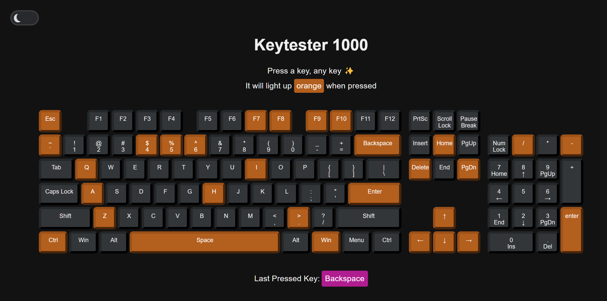
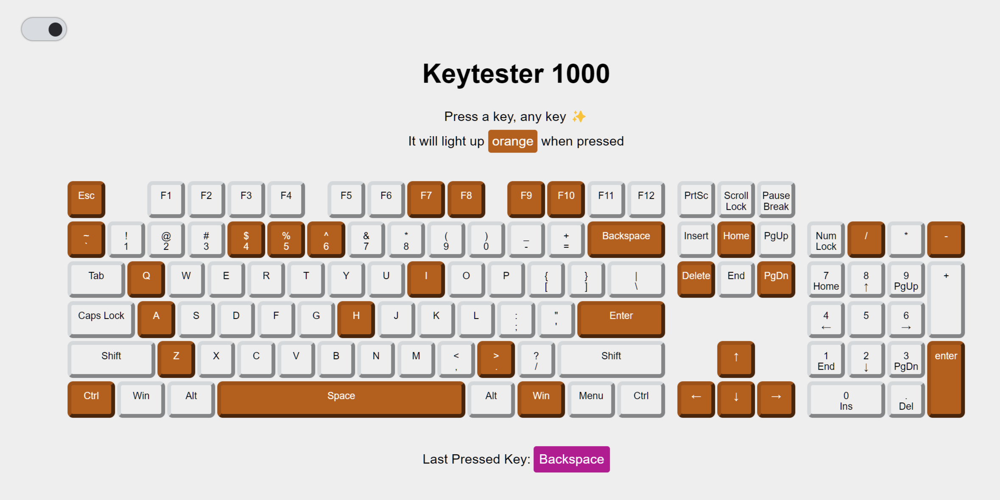

# Key Tester 1000

This page allows you to test the switches on your keyboard. When a key is pressed, it will turn orange & do a quick flash animation. The last pressed key is also displayed below the keyboard. The user can toggle between dark mode (default) and light mode by clicking a button. 

## Dark mode

## Light mode

